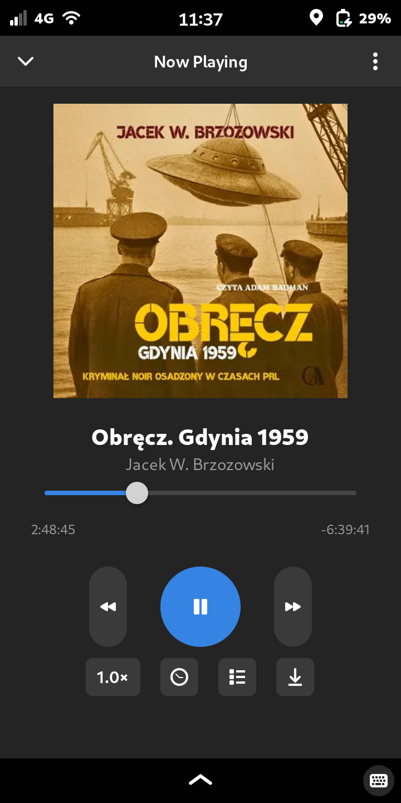
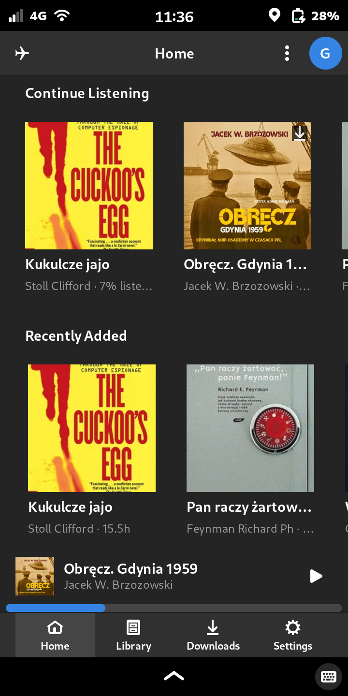
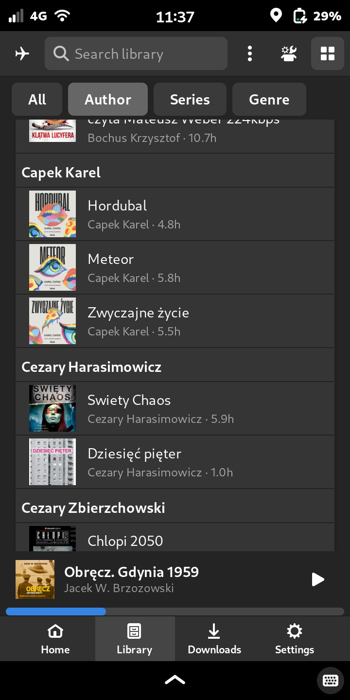
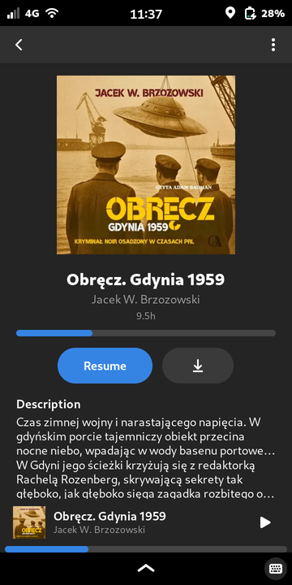
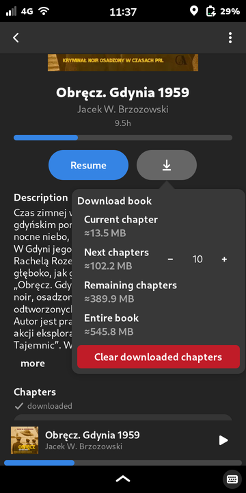
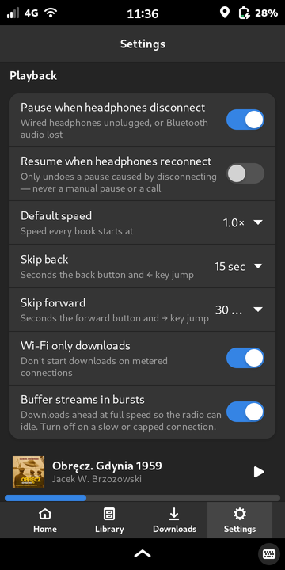
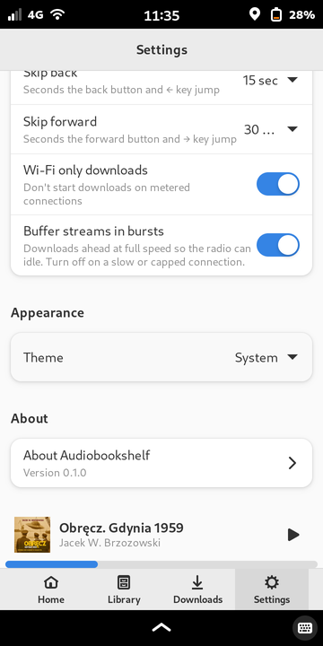

# mobile-linux-audiobookshelf-client

An [Audiobookshelf](https://audiobookshelf.org/) client for Librem 5 / Phosh.
Offline-first, fast Rust native code, installable on PureOS Crimson as a deb.
For other Linux phones, Appimage and Flatpak builds are available.

 

## Features

*Offline-First* - first-class support for downloading audiobooks to local
storage, syncing progress after listening offline. Has both manually enabled
offline mode and network loss detection.

*Phone, not Gnome* - a mobile app, not a responsive desktop program. Pause
on call, handle headphones unplugging, battery efficiency, playback
notification. Tested on a real, slow phone.

*Comfortable* - has playback speed, sleep timer, fast forward/rewind, search
and filtering.

*Free Software* - GPLv3 licensed, only makes network calls to your Audiobookshelf
server

### AI disclosure

The app has been developed using LLMs. 

Prompts by [GDR!](https://github.com/gjedeer/)

## Screenshots

Library Screen



Book Details



Chapter download options



Settings



Settings, in the light theme



## Installing

### Installing the Flatpak

The recommended way — adds a remote once, then `flatpak update` picks up
every new tagged release automatically:

```sh
flatpak remote-add --user --if-not-exists abs-app \
  https://gdr-aislop.github.io/mobile-linux-audiobookshelf-client/io.github.gdr_aislop.abs-app.flatpakrepo
flatpak install --user abs-app io.github.gdr_aislop.abs-app
```

Alternatively, download the `.flatpak` file from a
[release](../../releases) and install it directly, with no remote added:

```sh
flatpak install --user ./abs-app-<version>-<arch>.flatpak
```

### Installing the .deb via APT

The recommended way — adds the repo once, then `apt upgrade` picks up every
new tagged release automatically (arm64 and amd64 only):

```sh
sudo curl -fsSL https://gdr-aislop.github.io/mobile-linux-audiobookshelf-client/apt/abs-app.asc \
  -o /etc/apt/keyrings/abs-app.asc
echo "deb [signed-by=/etc/apt/keyrings/abs-app.asc] https://gdr-aislop.github.io/mobile-linux-audiobookshelf-client/apt stable main" \
  | sudo tee /etc/apt/sources.list.d/abs-app.list
sudo apt update
sudo apt install abs-app
```

This repo always carries the *latest* tagged release only (not a full
version history) — older `.deb`s stay available from
[past releases](../../releases) directly, via `sudo apt install
./abs-app_<version>_<arch>.deb`.

### Verifying a standalone `.deb` or `.AppImage`

Every `.deb` and `.AppImage` attached to a [release](../../releases) also
gets a detached signature (`<file>.asc`), from the same key that signs the
Flatpak and APT repos — useful if you downloaded one directly rather than
through either repo (an `apt install` from the hosted repo above is already
verified via its own signed `Release`/`InRelease`, with nothing extra to do):

```sh
gpg --import abs-app-signing-key.asc   # once, also attached to every release
gpg --verify abs-app_<version>_<arch>.deb.asc abs-app_<version>_<arch>.deb
gpg --verify abs-app-<version>-<arch>.AppImage.asc abs-app-<version>-<arch>.AppImage
```

The signing key's fingerprint is:

```
CC77 E444 A5CD 5384 0459  1237 08D0 546C 9455 D910
```

Check it against `gpg --fingerprint` after importing `abs-app-signing-key.asc`, since that
file is hosted alongside the binaries it verifies and shouldn't be the only
source trusted for the key itself.

### Building an AppImage manually

```sh
# Inside a Debian-family system with the dev + runtime packages installed:
./scripts/build-appimage.sh                       # x86_64, version from git
./scripts/build-appimage.sh --arch aarch64 --version 0.1.0

# Anywhere, via a Debian bookworm container (docker or podman):
./scripts/build-appimage-in-docker.sh

# aarch64 AppImage on an x86_64 host (arm64 container under QEMU emulation):
./scripts/build-aarch64-appimage-on-x86.sh
```

Output lands in `build/appimage/abs-app-<version>-<arch>.AppImage`.
`scripts/build-appimage.sh --help` documents environment overrides
(`ABS_APP_BIN`, `LINUXDEPLOY`, `APPIMAGE_TOOLS_DIR`); the docker wrapper
mirrors the CI job's package set via `scripts/appimage-builder-bookworm.Dockerfile`.

## Reporting problems

When reporting a bug, attach the contents of `~/.local/state/io.github.gdr_aislop.abs-app/`:

- `logs/abs-app.*` — a rotating, human-readable log file (last 7 days kept).
  A Rust panic always logs its full backtrace here, even without
  `RUST_BACKTRACE` set. By default the log is anonymized: server addresses,
  URLs, usernames, access tokens and your home directory are replaced with
  placeholders such as `<url>`, `<server>` and `<user>`, so it is safe to
  attach. Settings → Diagnostics → "Anonymize logs" turns this off, which is
  only useful while debugging a connection problem yourself. (Crash dumps
  below are not anonymized; they contain no log text but can include memory
  contents.)
- `crashes/crash-<timestamp>-<pid>.dmp` — a Breakpad-format minidump written
  for a native (signal-level) crash a Rust panic hook can't catch (a
  segfault/abort inside GTK/GStreamer/glib). It's binary, not directly
  readable: turn it into a stack trace with
  [`minidump-stackwalk`](https://crates.io/crates/minidump-stackwalk)
  (`cargo install minidump-stackwalk`), which also needs debug symbols from
  a build matching the exact version that crashed (an unstripped binary, or
  a separately retained `.debug` file).
